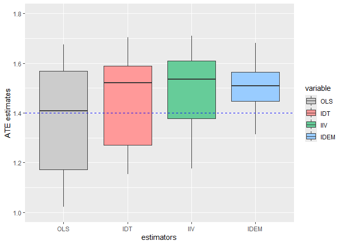

Simulation Study for IDEM estimator
================

## Simulation Setup

Required R packages

``` r
library(survival)
library(rootSolve)
library(geex)
library(ggplot2)
library(reshape2)
```

Sample size ($n$), number of simulations and maximum follow-up time
($\tau$)

``` r
n_sample <-  500
n_simul <- 500
tau <- 200
```

Prescribed dose $D_i$ model parameters
($\alpha_{0}, \alpha_{K_1}, \alpha_{K_2}, \alpha_{K_3}$)

``` r
alpha0<-120; alphaK1<-1.5; alphaK2<--2; alphaK3<--0.8 
```

Confounders ($K_1, K_2, K_3$) parameters

``` r
K1_mean<-5;  K1_sd<-1;  K2_prob<-0.55; K3_mean<-100; K3_sd<-5
```

Mediator ($Z_1$ or $Z_2$) parameters

``` r
Z1_mean<-4; Z1_sd<-sqrt(2); Z2_mean<-2; Z2_sd<-sqrt(1)
```

Response $Y_i(t)$ model parameters
($\beta_{0}, \beta_{K_1}, \beta_{K_2},\beta_{K_3},\beta_{A(t)},\beta_{Q},\beta_Z,\epsilon,\phi$)

``` r
beta0<-2; betaK1<-1; betaK2<-0.25; betaK3<--2; betaQ<-0; betaA<-1.4;betaZ<-3;
epsilon_sd<-0.1; phi_mean<-0; phi_sd<-0.2
```

Visits indicator $dN_i(t)$ model parameters
($\gamma_0, \gamma_{A(t)}, \gamma_{Z}, \gamma_{K_1},\gamma_{K_2},\gamma_{K_3},\gamma_{Q}$)

``` r
gamma0<--3.5; gammaA<-0.05;  gammaZ<-0.5; gammaK1<-0.1 ; gammaK2<--0.5; gammaK3<--0.05 ; gammaQ<-2 
```

Matrix that contains the estimates of OLS,IDT,IIV and IDEM

``` r
ATE_Mat <- data.frame(matrix(nr=n_simul, nc=1*4))
names(ATE_Mat) <- c("OLS","IDT","IIV","IDEM")
```

## Dataset simulation and ATE estimation

``` r
S <- 1 
for(S in 1  : n_simul){
  
## Dataset simulation
  
  # Initial matrix for the simulation of variables
  n_patients <- n_sample
  n_total <- n_patients*tau
  mat <- data.frame(matrix(NA, nrow=n_total, ncol= 11))
  
  names(mat)<- c('ID','time','D','Y','K1','K2','K3','Q','visit','Z', 'ratei')
  
  mat[,'ID'] <- rep(1:n_patients, each=tau)  
  mat[,'time'] <- rep(1:tau/100,  n_patients) 
  
  # Confounders
  mat[,'K1'] <- rep(rnorm(mean=K1_mean, sd=K1_sd, n=n_patients),each=tau)
  mat[,'K2'] <- rep(rbinom(p=K2_prob, size=1, n=n_patients),each=tau)
  mat[,'K3'] <- rep(rnorm(mean=K3_mean, sd=K3_sd, n=n_patients),each=tau)
  
  # Prescribed dose 
  mu_dose <- alpha0 + alphaK1*mat$K1+ alphaK2*mat$K2+ alphaK3*mat$K3
  mat[,'D'] <- rnorm(n=n_total, mean= mu_dose,sd=15) 
  mat_oneID <- mat[!duplicated(mat$ID),] 
  mat_oneID_D <- mat_oneID[,c('ID','D')]
  colnames(mat_oneID_D)[2] <- 'doset1'
  mat_final <- merge(mat,mat_oneID_D,by='ID')
  
  # Cumulative exposure
  mat_final$cumuldose <- ifelse(mat_final$doset1>100*mat_final$time,100*mat_final$time, floor(mat_final$doset1))
  
  # Mediator
  Z1 <- rnorm(mean=Z1_mean, sd=Z1_sd, n=n_total) 
  Z2 <- rnorm(mean=Z2_mean, sd=Z2_sd, n=n_total) 
  mat_final[,'Z'] <- ifelse(mat_final$cumuldose>90,Z2,Z1)                      
  centerZ <- ifelse(mat_final$cumuldose>90, Z2_mean, Z1_mean)
  
  mat_final[,'Q'] <- rnorm(mean=0.5, sd=0.1, n=n_total) 
  
  # Response variable
  phi <- rnorm(mean=phi_mean, sd=phi_sd,n=n_total)
  epsilon <- rnorm(mean=phi, sd=epsilon_sd, n=n_total)
  
  mat_final[,'Y'] <- beta0 + betaA*mat_final$cumuldose + betaK1*mat_final$K1 + betaK2*mat_final$K2 +
    betaK3*mat_final$K3 + betaZ*(mat_final$Z - centerZ) + betaQ*mat_final$Q+epsilon
  
  
  # Visits rate
  ratei <- exp(gamma0 + gammaA*mat_final[,'cumuldose'] + gammaZ*mat_final[,'Z'] + gammaK1*mat_final[,'K1'] +
                 gammaK2*mat_final[,'K2'] + gammaK3*mat_final[,'K3'] + gammaQ*mat_final[,'Q'] ) 
  
  ratei[ratei>1] <- 0.9999999999999 
  mat_final[,'ratei'] <- ratei
  
  
  # Visits indicator
  mat_final[,'visit'] <- rbinom(prob= ratei, size=1, n=n_total)  
  
  
  
## ATE Estimation
  
  Data <- mat_final
  Data[Data$visit==0,]$Y <- NA 
  
  
  # IIV weight : we assume a proportional rate model
  
  Data$t1 <- Data$time-0.01
  Data$t2 <- Data$time
  coxfit <- coxph(Surv(t1,t2,visit)~cumuldose+Z+K1+K2+K3+Q,data=Data)
  gamma <- coxfit$coef 
  
  
  # Baseline hazard
  baseh <- basehaz(coxfit, centered=FALSE)
  colnames(baseh)[2] <- 'time2'
  haz <- baseh[,1][-1] - baseh[,1][-(length(baseh[,1]))]
  baseh$col3 <- round(baseh[,2],2) 
  baseh$haz <- c(baseh$hazard[1],haz)
  Data$col3<- round(Data$time,2)
  dat1 <- merge( baseh, Data, all.y=TRUE, by='col3') 
  Data <- dat1[order(dat1$ID, dat1$time),]
  
  
  Data$w_iiv <- Data$haz*exp(gamma[1]* Data$cumuldose + gamma[2]*Data$Z + gamma[3]*Data$K1 + gamma[4]*Data$K2+ 
                               gamma[5]*Data$K3 + gamma[6]*Data$Q) 
  
  
  # IDT weight : we assume a normal distribution for prescribed dose

  DataIDT <- Data
  
  DataIDT$pred_doset1 <- predict( glm(doset1 ~ K1 + K2 + K3,data=DataIDT), type='response')
  DataIDT$residuals <- DataIDT$doset1 - DataIDT$pred_doset1
  var_residuals <- var(c(DataIDT$residuals))
  
  DataIDT$pred_doset1_stab <-predict( glm(doset1 ~ 1, data=DataIDT), type='response')
  DataIDT$residuals_stab <- DataIDT$doset1 - DataIDT$pred_doset1_stab
  var_residuals_stab <- var(DataIDT$residuals_stab)
  
  
  DataIDT$density <- 1/sqrt(2*pi)*1/sqrt(var_residuals)*exp(-DataIDT$residuals^2/(2*var_residuals))
  DataIDT$density_stab <- 1/sqrt(2*pi)*1/sqrt(var_residuals_stab)*
    exp(-DataIDT$residuals_stab^2/(2*var_residuals_stab))
  
  Datafinal <- cbind(Data, DataIDT[,c('ID','density','density_stab')])
  
  
  Datafinal$w_idt <- Datafinal$density_stab/(Datafinal$density)
  
  
  
  
  # OLS, IDT, IIV estimators
  
  OLS <-lm(Y~ 1+ cumuldose, data=Datafinal)$coef[2] 
  IDT <-lm(Y~ 1+ cumuldose, weights=w_idt, data=Datafinal)$coef[2]
  IIV <- lm(Y~ 1 + cumuldose, weights=1/w_iiv, data=Datafinal)$coef[2]
  IDEM <- lm(Y~ 1 + cumuldose, weight=w_idt*1/w_iiv, data=Datafinal)$coef[2]

  ATE_Mat[S,] <- c(OLS,IDT,IIV,IDEM)
  
}
```

## Results

``` r
ggplot(data = melt(ATE_Mat, id.vars = NULL), aes(x=variable, y=value)) +
         geom_boxplot(aes(fill=variable)) + labs(x = "estimators", y = "ATE estimates") + 
  geom_hline(yintercept =1.4, linetype = "dashed", color = "blue") +
  scale_fill_manual(values=c("#CCCCCC", "#FF9999", "#66CC99","#99CCFF"))+ ylim(c(1,1.8))
```

<!-- -->
